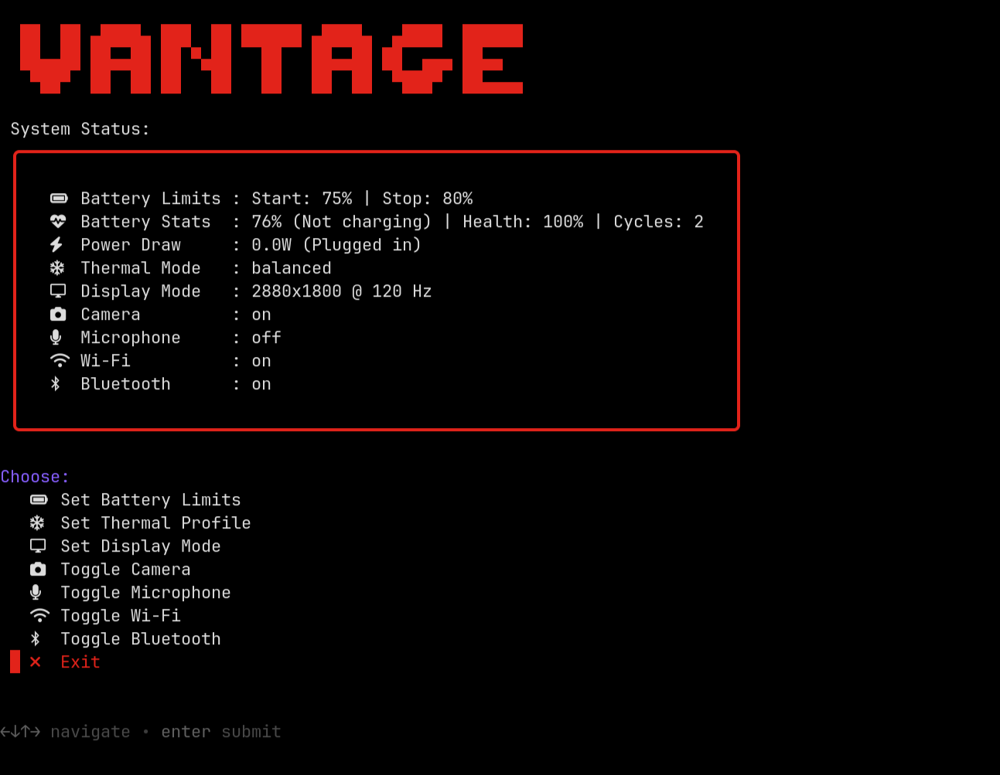

<div align="center">

# Minimal-Vantage

**A minimal Terminal User Interface (TUI) to control hardware settings on Lenovo ThinkPads**
<br>

[](https://kernel.org)
[](https://wayland.freedesktop.org/)
[](https://opensource.org/licenses/MIT)
<br><br>



</div>

## Compatibility

Based on Linux kernel ACPI drivers (Kernel 5.12+) and expected to work on Lenovo hardware from **2021 onwards**, including:
* **ThinkPad X1 Carbon** (Gen 9 through Gen 13+)
* **ThinkPad T-Series** (T14/T14s Gen 2+)
* **ThinkPad P-Series** (P14s, P1, etc.)
* **ThinkPad X1 Yoga** (Gen 6+)
* *Other modern Lenovo models utilizing the `thinkpad_acpi` driver.*

An ideal, simple, keyboard driven solution for **`wlroots`** users: remains compatible with **GNOME** and **KDE Plasma** without enforcing `wlr-randr` in Desktop Environment (DE) setups.

Certain features require root access; **in-menu root authentication** —including fingerprints if pre-configured (e.g., PAM/`fprintd` on Fedora)— **is** supported; thereby, visual flow stays consistent.

## Features

* **Battery Conservation:** Set start/stop charging thresholds to prolong battery life with path detection.
* **Telemetry:** Readouts of Battery Health %, Cycle Counts, and Power Draw (Watts) snapshot.
* **Thermal/Fan Modes:** Switch between `low-power`, `balanced`, and `performance` ACPI profiles.
* **Display Control (`wlroots` only):** Adjust resolution and refresh rate via `wlr-randr`. 
* **Microphone Privacy:** Instant audio muting via PipeWire.
* **Radios:** Quick toggles for Wi-Fi and Bluetooth using native kernel `rfkill` without reliance on NetworkManager or BlueZ.
* **Camera Privacy:** Attempts to load/unload the standard webcam kernel module.
* **Persistence:** Save settings across reboots, with a light installer that supports both `systemd` and non-systemd environments.

> [!NOTE]
> Newer ThinkPad models utilize Intel IPU6 (MIPI) architecture, and bypasses the internal USB hub; therefore, the `uvcvideo` driver may be absent, causing software toggles in this TUI to appear unresponsive. The actual switch (ThinkShutter) remains functional at the hardware level.

## Requirements

* Linux kernel ACPI drivers (Kernel 5.12+)
* `gum` (The terminal UI engine)
* A Nerd Font (e.g., `jetbrains-mono-nerd-fonts`)
* `pipewire` / `wireplumber` (Provides `wpctl` for microphone toggling)
* `wlr-randr` required **ONLY** for display control on wlroots compositors; likely already installed by WM users. Incompatible with most DEs. 

### Fedora

```bash
sudo dnf copr enable maveonair/jetbrains-mono-nerd-fonts
sudo dnf install gum pipewire jetbrains-mono-nerd-fonts
```

### Arch

```bash
sudo pacman -S gum pipewire wireplumber ttf-jetbrains-mono-nerd
```

### Ubuntu/Debian

```bash
sudo mkdir -p /etc/apt/keyrings
curl -fsSL https://repo.charm.sh/apt/gpg.key | sudo gpg --dearmor -o /etc/apt/keyrings/charm.gpg
echo "deb [signed-by=/etc/apt/keyrings/charm.gpg] https://repo.charm.sh/apt/ * *" | sudo tee /etc/apt/sources.list.d/charm.list
sudo apt update && sudo apt install -y gum pipewire wireplumber

wget https://github.com/ryanoasis/nerd-fonts/releases/latest/download/JetBrainsMono.zip
unzip JetBrainsMono.zip -d ~/.local/share/fonts
fc-cache -fv
rm JetBrainsMono.zip
```

## Installation

Clone the repository and install it globally via `make`:

```bash
git clone https://github.com/AdmiralBarbarossa/Minimal-vantage.git
cd Minimal-vantage
sudo make install
```

Upon installation, run `vantage` in terminal. Native `sudo` authentication (including fingerprint) is supported inline.

> [!TIP]
> **Non-Systemd Environments (Void, Artix, Alpine):** The `Makefile` automatically detects the init system and bypass `systemd` service installation; the following persistence methods could help:
> * Append `/usr/local/bin/vantage-core --restore` to `/etc/rc.local` (Void/runit), an `/etc/local.d/*.start` script (OpenRC), or a root crontab (`@reboot`). 
> * By configuring `/etc/sudoers` for `NOPASSWD` execution of the core binary, the command `exec sudo /usr/local/bin/vantage-core --restore` (or `exec-once` for Hyprland) can be invoked from the compositor configuration; ***However***, *it ties hardware state to the graphical session rather than the boot sequence!*

## Uninstallation

```bash
sudo make uninstall
```

## Usage & Navigation

The pre-compiled nature of the Charmbracelet’s `gum` prevents custom remapping of keys; the default engine supports Vim-style vertical movement.

* **`j` / `k` (or Arrows):** Navigate up and down.
* **`Enter`:** Confirm selection or enter a submenu.
* **`Esc`:** Cancel the current prompt, return to the main menu, or quit the application.

## Inspiration & Alternatives

Inspired by the [niizam/vantage](https://github.com/niizam/vantage) repository, **Minimal-Vantage** adapts the concept for **ThinkPads** and modern workflows. While the original project targets Lenovo IdeaPads/Legions on legacy X11, this alternative swaps GTK popups (`zenity`) and X11 protocols for terminal-native styling (`gum`) and Wayland support (`wlr-randr`).

Unlike background suites like **TLP** or **auto-cpufreq**, this is an one-shot boot service alternative with no persistent background process; already achieves ~5W draw @ 30°C (0 RPM) on 268V Fedora + River with `tuned` and `thermald` without the reliance on such tools. 

## Contributing & Feedback

Lenovo's hardware architecture and ACPI implementation can vary between generations and specific models. In the event of errors, bugs, or suggestions to make the script faster or more robust, as well as hardware compatibility confirmations, **Issues** or **Pull Requests** are much appreciated.

